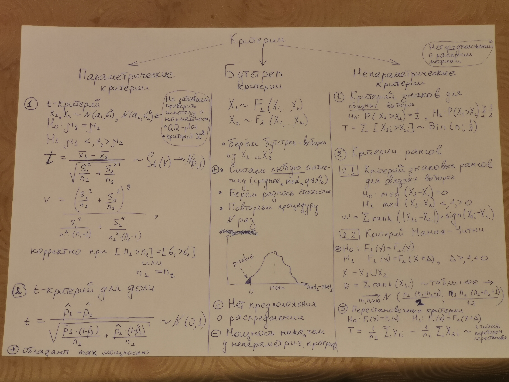
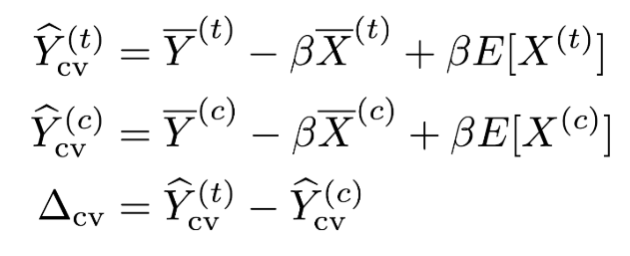
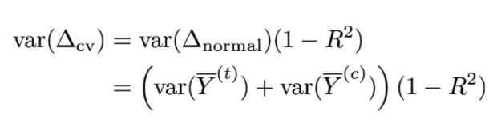

# 1. Basic tests

# 2. A/B speed-up
## 2.1 CUPED
CUPED - Controlled experiment Using Pre-Experiment Data;  
Inspired by [this](https://www.tripadvisor.com/engineering/reducing-a-b-test-measurement-variance-by-30/) great article

The idea of CUPED is to change target variable by 
substractting pre-defined (pre experiment) variables

We can get beta from regression of centered Y on centered X
* Center Y, X on the whole dataset (no split by A, B groups)
* Run regression on the whole dataset

R2 in this regression - % of variance reduction. 
Resulting delta_cv variance can be calculated as:

**Note**: we can run any test on new Y
